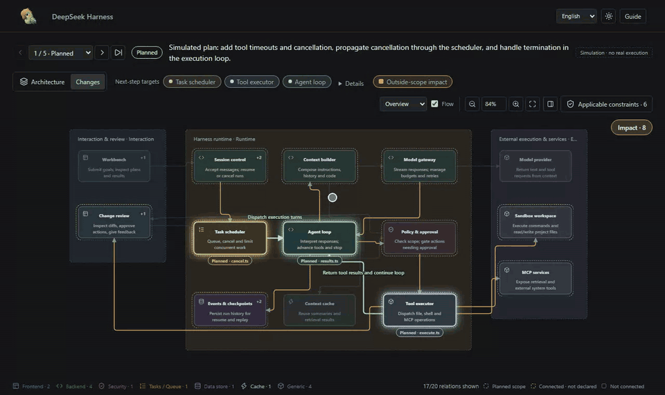
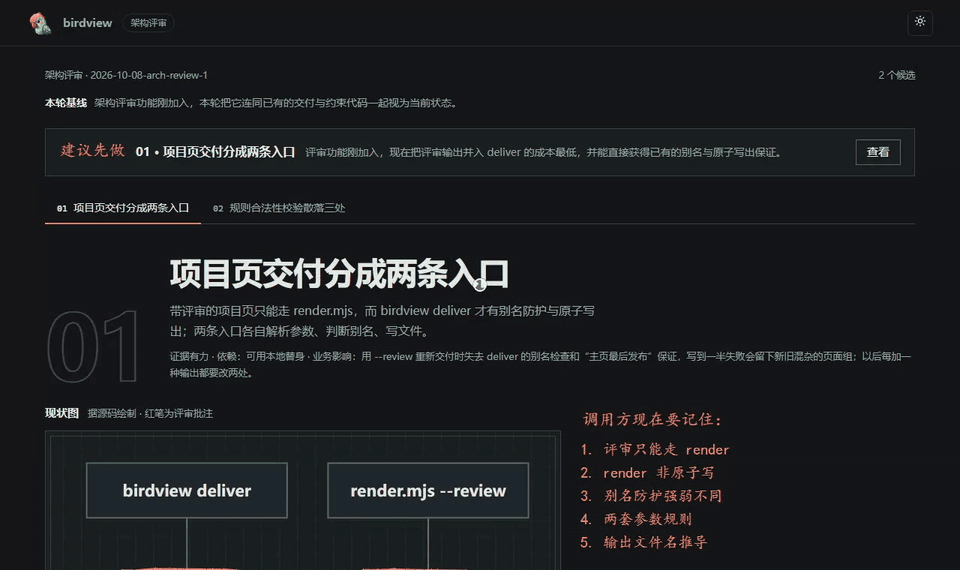
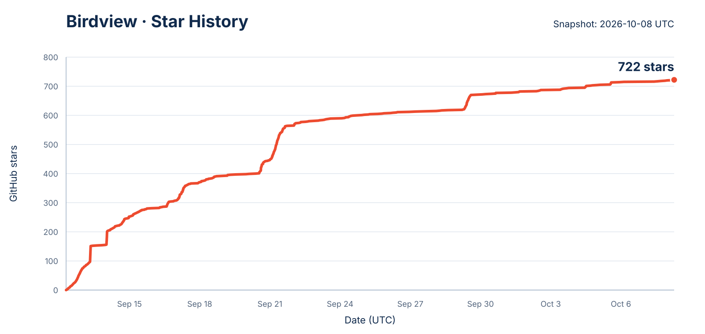

<div align="center">
  
  <h1>Birdview</h1>
  <p><strong>The future of programming comes down to two things: constraints and architecture.</strong></p>
  <p>Have the AI draw the system as it sees it, the rules it must follow and the scope it plans to change, then confirm before any code moves.<br>Shift your attention from code to architecture, and open the black box of AI coding.</p>
  <p>
    
    
    
    
    
    <a href="https://linux.do"></a>
  </p>
</div>

<p align="center">
  <a href="#quick-start">Quick Start</a> ·
  <a href="#three-views">Three Views</a> ·
  <a href="#how-it-works">How It Works</a> ·
  <a href="examples/harness-activity.html">Live Demo</a> ·
  <a href="https://qiuner.github.io/birdview/">Project Site</a> ·
  <a href="README.zh.md">简体中文</a>
</p>

<!-- [简体中文](README.zh.md) -->

Birdview is a skill for AI coding agents. It draws a project's **architecture**, its **constraints** and the **scope of the current change** on one map: the agent shows its understanding and plan, waits for your confirmation, then implements and records the checks it actually ran. The output is a standalone HTML page that opens in a browser, with no service to deploy.

<p align="center">
  
</p>

> The demo uses the fictional agent harness included in this repository. It does not represent observed production activity.

## New in v0.4.0

- **Architecture review**: see source-backed current drawings, red-pencil findings and proposed redesigns before approving implementation.
- **Skill compatibility audit**: understand which requests can trigger overlapping skills, with scenario-specific conclusions and evidence in a text report.
- **Change paths and outside-scope impact**: trace the declared plan and inspect directly connected modules outside its scope.

See the [release notes](docs/release-notes-0.4.0.md) for invocation examples, installation and upgrade notes.

## Why Birdview

Ask an AI to "add rate limiting to the login endpoint":

- **Normal flow:** the AI searches and edits immediately, and you are left to guess from the final diff whether anything was missed or changed by mistake.
- **Birdview flow:** the AI first shows the login modules, the applicable interface and security rules, the files it plans to touch and the evidence behind each choice. It implements only after you confirm that scope, and records the checks it actually ran.

Logs say which actions the AI took and diffs say which lines changed, but neither answers: where does this change sit in the system, what else can it reach, and why does the AI think these files belong to the task? Birdview lets you catch scope mistakes before the implementation is finished, instead of guessing afterwards.

It does not observe every agent action automatically, and it does not replace Git diffs, tests or code review.

## Three Views

Switch with **Architecture · Constraints · Review** at the top of the page.

**Architecture**: the modules in the project, what each owns and how they connect, with source evidence for every claim. When activity is supplied, the same map becomes the **changes view**: it marks the modules and files the agent declared, its current step, and an outside-scope impact layer showing modules directly connected to the plan but not declared.

**Constraints**: reviewed rules with their conditions, explanations, source text and versions. Browse by topic to understand them or by directory to trace files; Coverage states which sources were reviewed and what remains open. Collected documents are not automatically effective rules, and displaying a rule does not prove the implementation satisfies it.

**Review**: the architecture review page. Ink draws the facts found in source, a red pencil circles the problems, and a clean redraw marked as a proposal shows the improvement. Evidence is quoted source text. Rendering with `--repo` checks it line by line against the recorded source revision or working tree; without a repository, quotations are marked unchecked.

<p align="center">
  
</p>

> The review in this recording is the bundled example, written in Chinese; the interface also supports English.

Every view supports light and dark themes and a Chinese or English interface, and inputs are checked for structure and consistency before rendering.

## Quick Start

Install it with the third-party `skills` CLI:

```sh
npx skills add Qiuner/birdview --skill birdview
```

Start a new agent task and invoke the skill explicitly. **By default, Birdview runs only when requested; ordinary edits trigger it only after you enable project auto mode.**

**Codex:** type `/skills` and select Birdview, or enter:

```text
$birdview Show this project's architecture and constraints; do not edit code.
```

**Claude Code:** enter:

```text
/birdview Show this project's architecture and constraints; do not edit code.
```

For DeepSeek Harness and other hosts, use their skill selector or explicitly ask to use Birdview; slash-command support depends on the host.

When it works, the agent delivers a browser-readable page with the architecture, reviewed constraints, source evidence and review gaps. If constraints cannot be reviewed, it should explain the missing coverage instead of inventing rules. Map-only requests end after delivery; coding requests stop and wait for you to confirm the displayed plan.

See the [installation guide](docs/installation.md) for complete setup and verification steps, and the [0.4.0 release notes](docs/release-notes-0.4.0.md) for this release's features and limitations.

### Example Pages

The repository has 2 example pages. Both are offline HTML; open them directly in a browser without running anything:

| Page | Views | Data |
|---|---|---|
| [`examples/harness-activity.html`](examples/harness-activity.html) | Architecture and Changes (with outside-scope impact) | Simulated project and agent activity |
| [`examples/review.html`](examples/review.html) | Architecture review: red-pencil marks on the current drawing, the clean redraw and source clippings | An AI-generated review of Birdview itself: two candidates on page delivery and rule validation; quotes are checked line by line against the source |

The constraint view needs a curated constraint catalog first, so there is no ready-to-open example for it yet.

To regenerate the examples from source, use Node.js 18 or newer:

```sh
npm ci
npm run validate:examples
npm test
npm run build:demo
```

## Community and Feedback

For installation help, inaccurate architecture maps, or discussion about Architecture-first Coding, join the Birdview user community.

<p align="center">
  
</p>

<p align="center"><strong>QQ group: 627760389</strong></p>

You can also [share feedback on GitHub](https://github.com/Qiuner/birdview/issues/new?template=usage_feedback.yml). Successful runs, missing modules, incorrect relationships, and installation problems are all welcome. No private source code is needed; screenshots and sanitized examples are optional.

## Invocation

In either mode, once activated Birdview displays the map and proposed changes, then waits for your confirmation before editing code. Confirmed work continues without repeated prompts within the same scope; material scope changes require a new confirmation. Map-only requests end after delivery. This is agent guidance, not a write lock enforced by the HTML page.

Birdview runs **on demand by default**; ordinary coding, small fixes and feature planning do not trigger it:

- **Codex:** type `/skills` and select Birdview, or mention `$birdview`.
- **Claude Code:** invoke the installed skill with `/birdview`.
- **DeepSeek Harness and other hosts:** use the host skill selector or explicitly ask to use Birdview.

For example: "Use Birdview to show this project's architecture and constraints without changing code." The invocation applies to the current task, not future edits.

**Auto mode** is optional: it activates before every code change, including small edits, and before planning that explicitly analyzes affected modules. New projects default to on-demand; existing `Birdview mode: auto` blocks in `AGENTS.md` or `CLAUDE.md` remain effective. Choose or query project mode:

```sh
node <skill-root>/scripts/birdview.mjs mode auto --project <project-root>
node <skill-root>/scripts/birdview.mjs mode on-demand --project <project-root>
node <skill-root>/scripts/birdview.mjs mode --project <project-root>
```

Setup defaults new projects to `on-demand` and preserves existing `auto`, `on-demand` or `off` settings. Codex and DeepSeek Harness use `AGENTS.md`; add `--agent claude-code` for `CLAUDE.md`. Other projects are not rewritten automatically. Start a new task after upgrading. See [mode details](references/modes.md).

### Architecture Review

Ask "optimize this project's architecture" or "review the module boundaries" to start the architecture-review workflow. Birdview reads the source first, then presents the current drawing and a proposed redraw, source evidence, benefits, migration cost and verification steps. Review the displayed proposal before authorizing implementation. Ordinary bug fixes, local refactors and requests to draw the current architecture alone do not start a review.

The dedicated entry lives in `review-skill/`. Install it as `birdview-review` alongside the complete `birdview` skill in the same skills directory; it depends on that bundle's references and renderer. Installing only the main skill does not install this entry. In Codex, select Birdview Review or enter:

```text
$birdview-review Review this project's architecture and show improvement proposals; do not edit code yet.
```

In Claude Code, use `/birdview-review` after installing the entry. The main Birdview skill also routes architecture-improvement requests to the same workflow. Natural-language selection depends on the host discovering the installed skill; start a new task after installation or updates to check activation. These are agent skill invocations, not `birdview` CLI subcommands. See the [review workflow](references/review-architecture.md) and the [review contract](references/review-contract.md).

### Skill Compatibility Audit

Use `$birdview-compatibility` in Codex or `/birdview-compatibility` in Claude Code to check whether installed skills can be activated together. The audit first inventories the effective skill roots, then reads the relevant skill bodies to compare trigger scope, invocation mode, write permissions and confirmation gates. It reports duplicate installs, trigger overlaps and scenario-specific compatibility conclusions, with the evidence used for each conclusion.

For a direct CLI run, write both machine-readable and human-readable results:

```sh
node <skill-root>/scripts/birdview.mjs skills audit \
  --project <project-root> \
  --language en \
  --assessment <project-root>/.birdview/compatibility-assessment.json \
  --write <project-root>/.birdview/compatibility-audit.json \
  --write-markdown <project-root>/.birdview/compatibility-audit.md
```

Pass `--language zh` for a Chinese report. The command is read-only with respect to installed skills: it does not disable, rewrite or reorder another skill, and it does not generate an architecture diagram. Review the Markdown report before changing skill configuration.

## Viewer Guide

On an integrated page, switch between **Architecture**, **Constraints** and **Review** at the top (the latter two appear when their data was rendered). Select a module to inspect responsibilities, files and evidence; activity history records the agent-declared plan, progress and checks.

In Constraints, browse **by topic** to understand rules, or **by directory** to trace their files. Double-click a node to read its explanation or source text, and use **Coverage** to inspect the reviewed scope and gaps. Role colors match the architecture palette; they do not represent compliance.

In Review, hovering a node highlights the same node in both drawings; numbered tabs switch between candidates, and the recommendation banner jumps to the suggested one.

On the first visit, follow **Guide** for a short walkthrough, or skip it and press Escape at any time. You can reopen it later from the toolbar.

## Generate the HTML Directly

The agent normally handles these steps. If you already have an architecture file in the expected format, you can validate it and generate the HTML yourself:

```sh
node scripts/validate.mjs .birdview/architecture.json
node scripts/render.mjs .birdview/architecture.json .birdview/architecture.html
```

To add the task activity declared by the agent:

```sh
node scripts/validate.mjs .birdview/architecture.json .birdview/activity.jsonl
node scripts/render.mjs .birdview/architecture.json .birdview/activity.html .birdview/activity.jsonl
```

To include an already collected and reviewed constraint catalog:

```sh
node scripts/birdview.mjs deliver .birdview/architecture.json .birdview/project.html --constraints .birdview/constraints.reviewed.json
```

The CLI writes one integrated page with in-page source reading. For source discovery, rule review and standalone constraint rendering, see the [constraint workflow](references/constraint-graph.md).

To render an architecture review and check every source quote line by line:

```sh
node scripts/render-review.mjs .birdview/review.json .birdview/review.html --repo .
```

Add `--bilingual` when both Chinese and English content must be validated. Use `--simulation` only to mark fictional demo activity.

## How It Works

```text
project source ─────> architecture.json ──────┐
local rules + review > constraints.reviewed.json ├─> validate / render ─> HTML
agent declarations ─> activity.jsonl ─────────┘
```

`architecture.json` describes project modules, responsibilities, file ownership, source evidence, and relationships. The optional `activity.jsonl` records the task scope, current target, progress, and verification results declared by the agent, one event per line. `constraints.reviewed.json` carries collected sources, reviewed rules and coverage. Rendering validates the supplied data before generating HTML.

The workflow has four steps:

1. **Understand architecture and constraints:** read source and local instructions, reuse or update the map, and disclose review gaps.
2. **Show the plan:** identify affected modules and files, intended behavior, applicable rules and proposed checks.
3. **Confirm the scope:** wait for your explicit confirmation in the conversation before implementation. Reuse confirmation of the same plan; confirm material scope changes again.
4. **Implement and verify:** work within the confirmed scope, record actual checks and report remaining limitations.

Confirmation does not mean tests passed. You can explicitly waive the confirmation step for a particular task; simply asking for a feature or enabling auto mode is not such a waiver.

See [Stage 1: Map a project](references/map-project.md) and [Stage 2: Show changes](references/show-changes.md) for the complete workflow.

## Data Contracts

| Artifact | Purpose |
| --- | --- |
| `architecture.json` | Project identity, modules, ownership, evidence, relationships, groups, and stable layout |
| `constraints.reviewed.json` | Collected sources, reviewed rules, applicability, version information and review coverage |
| `activity.jsonl` | Ordered, agent-declared task scope, targets, files, phases, and verification records |
| `review.json` | Architecture review: current drawing and redraw, red-pencil findings, caller knowledge and quoted source evidence |
| `architecture.html` | Generated viewer containing the map, optional constraint catalog and activity history |

The schemas enforce structure. [`scripts/validate.mjs`](scripts/validate.mjs) also checks cross-record rules such as stable map identity, contiguous sequences, valid scope and targets, file ownership, and consistent check results. Validation does not prove that architecture claims are true or that referenced source files exist.

## Project Layout

| Path | Contents |
| --- | --- |
| [`src/`](src) | TypeScript sources for contracts, CLI tools, browser viewer and website |
| [`schemas/`](schemas) | Architecture, activity and review JSON Schemas |
| [`scripts/`](scripts) | Validator, standalone renderer, and documentation checks |
| [`assets/`](assets) | Viewer templates, styles and generated browser bundles |
| [`examples/`](examples) | Example maps, activity records, review data and the generated interactive pages |
| [`references/`](references) | Authoring workflow, contract, activity, and bilingual guidance |
| [`test/`](test) | Contract, rendering, and optional browser-level checks |

## Current Boundaries

Birdview 0.4.0 uses file snapshots:

- Collected sources, rule applicability and verified compliance are distinct; incomplete review must be disclosed.
- User confirmation is recorded in the conversation, not enforced by an HTML approval button or filesystem lock.
- Activity is declared by an agent; Birdview does not automatically observe coding operations.
- Updates require regenerating the HTML and refreshing the browser.
- Live transport, automatic refresh, and rendered-display acknowledgements are not implemented.
- A `completed` event does not prove checks passed; only recorded check results make that claim.
- The package is currently marked private and is not published to npm.

## Development

```sh
npm test                 # Contract and renderer tests
npm run validate:examples
npm run build:demo       # Rebuild the example pages
node scripts/check-docs.mjs
```

Browser-level checks live in [`test/viewer.browser.mts`](test/viewer.browser.mts) and require a local Playwright installation or `BIRDVIEW_PLAYWRIGHT_PATH` pointing to one.

For the field semantics and invariants, read the [Birdview contract](references/contract.md). Documentation changes must follow the bilingual rules in [CONTRIBUTING.md](CONTRIBUTING.md). For release preparation, see the [release checklist](docs/releasing.md).

## Star History

<p align="center">
  
</p>

> Snapshot generated from the current GitHub stargazer list on October 8, 2026. GitHub may later remove anomalous stars; see [Issue #33](https://github.com/Qiuner/birdview/issues/33) for the public record.

## License

Released under the [MIT License](LICENSE). Copyright (c) 2026 Qiuner.
Third-party notices are preserved in [THIRD_PARTY_NOTICES](THIRD_PARTY_NOTICES).
