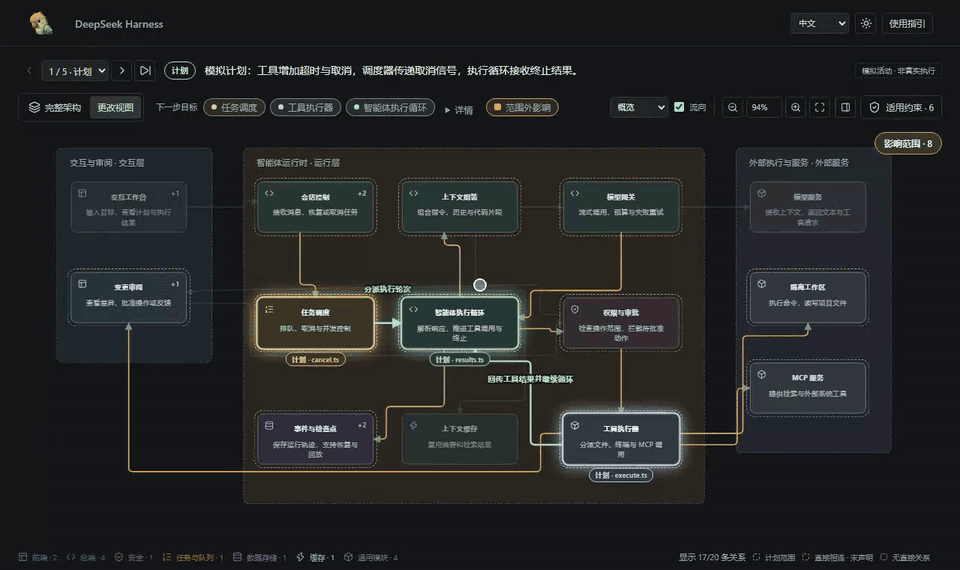

<div align="center">
  
  <h1>Birdview</h1>
  <p><strong>编程的未来只剩两件事：约束与架构。</strong></p>
  <p>让 AI 先画出它眼中的系统、要遵守的规则和准备改动的范围，你确认后再动代码。<br>从盯着代码转向看架构，打开 AI coding 的黑盒。</p>
  <p>
    
    
    
    
    
    <a href="https://linux.do"></a>
  </p>
</div>

<p align="center">
  <a href="#快速开始">快速开始</a> ·
  <a href="#三个视图">三个视图</a> ·
  <a href="#工作原理">工作原理</a> ·
  <a href="examples/harness-activity.html">交互演示</a> ·
  <a href="https://qiuner.github.io/birdview/">项目介绍页</a> ·
  <a href="README.md">English</a>
</p>

<!-- [English](README.md) -->

Birdview 是一个安装给 AI 编程 Agent 的 Skill。它把项目的**架构**、**约束**和本次**改动范围**画在同一张图上：Agent 先展示它的理解和计划，等你确认，再实施并记录真实的验证结果。输出是一个独立的 HTML 页面，浏览器直接打开，不需要部署任何服务。

<p align="center">
  
</p>

> 演示使用仓库内置的虚构智能体运行框架，不代表观测到的生产活动。

## v0.4.0 新功能

- **架构评审**：查看有源码依据的现状图、红笔批注和优化建议，确认方案后再实施。
- **技能兼容性体检**：检查哪些请求会触发重叠技能，用文字报告说明具体场景、结论和证据。
- **更改路径与范围外影响**：追踪已声明的计划，核对改动范围之外直接相连的模块。

触发示例、安装方式和升级提醒见[发布说明](docs/release-notes-0.4.0.zh.md)。

## 为什么需要它

让 AI“给登录接口增加限流”：

- **普通流程：** AI 直接搜索、直接改，你只能从最后的 diff 里猜它有没有漏改、误改。
- **Birdview 流程：** AI 先展示登录相关模块、适用的接口和安全规则、准备改的文件以及判断依据。你确认范围后，它才动手，并记录实际跑过的检查。

日志告诉你 AI 做了哪些操作，diff 告诉你哪些行变了，但它们都回答不了：这个改动在系统的哪个位置？还会波及谁？AI 凭什么认为这些文件属于本次任务？Birdview 让你在代码写完之前就发现范围错误，而不是事后再猜。

它不会自动监听 Agent 的每一步，也不替代 Git diff、测试或代码审查。

## 三个视图

页面顶部用 **架构 · 约束 · 评审** 切换。

**架构**：项目有哪些模块、各自负责什么、怎样连接，每个结论都附有源码依据。提供活动记录后，同一张图会变成**更改视图**：标出 Agent 声明要改的模块和文件、当前进行到哪一步，并用「范围外影响」显示与计划直接相连、却没有声明的模块。

**约束**：已审查规则的适用条件、解释、来源原文和版本。可以按主题理解规则，也可以按目录追溯文件；「阅读范围」会说明哪些来源已审查、哪些还没覆盖。收集到的文档不等于规则自动生效，展示规则也不代表实现已经满足它。

**评审**：架构评审页。墨线画源码里的事实，红笔圈出问题，再画一张「建议稿」给出改进方案；依据引用源码原文；使用 `--repo` 生成时，会与记录的源码版本或工作区逐行核对，未提供仓库时标记为未核对。

<p align="center">
  
</p>

> 录屏中的评审是仓库自带的示例，内容为中文；界面也支持英文。

所有视图都支持明暗主题、中英文界面，渲染前会校验输入的结构与一致性。

## 快速开始

使用第三方 `skills` CLI 安装：

```sh
npx skills add Qiuner/birdview --skill birdview
```

在 Agent 中新建一个任务，主动调用技能。**默认只在你明确要求时运行；开启项目自动模式后，才会在普通代码修改前自动触发。**

**Codex：** 输入 `/skills` 选择 Birdview，或输入：

```text
$birdview 展示这个项目的架构和约束，不修改代码
```

**Claude Code：** 输入：

```text
/birdview 展示这个项目的架构和约束，不修改代码
```

DeepSeek Harness 等其他宿主，使用各自的技能选择器，或明确要求使用 Birdview；是否支持斜杠命令取决于宿主。

成功时，Agent 会交付一个能在浏览器里阅读的页面，包含架构、已审查的约束、来源证据和审查缺口。无法完成约束审查时，它应当说明缺了什么，而不是编造规则。只看图的请求交付后就结束；编码请求会停下来等你确认展示的方案。

完整的安装和验证步骤见[安装指南](docs/installation.zh.md)，本版功能与限制见 [0.4.0 发布说明](docs/release-notes-0.4.0.zh.md)。

### 示例页面

仓库里有 2 个示例页面，都是离线 HTML，不用运行任何命令，直接在浏览器中打开：

| 页面 | 视图 | 数据 |
|---|---|---|
| [`examples/harness-activity.html`](examples/harness-activity.html) | 完整架构、更改视图（含范围外影响） | 模拟的项目和 Agent 活动 |
| [`examples/review.html`](examples/review.html) | 架构评审：现状图上的红笔批注、誊清稿和源码剪报 | 由 AI 实际评审 Birdview 自身生成：页面交付与规则校验两个候选，引用已与源码逐行核对 |

约束视图需要先整理约束目录，仓库里暂时没有可直接打开的示例。

想从源码重新生成示例，需要 Node.js 18 或更高版本：

```sh
npm ci
npm run validate:examples
npm test
npm run build:demo
```

## 交流与反馈

遇到安装问题、架构图不准确，或者想交流 Architecture-first Coding，欢迎加入 Birdview 用户交流群。

<p align="center">
  
</p>

<p align="center"><strong>QQ 群：627760389</strong></p>

也可以直接在 GitHub [分享使用反馈](https://github.com/Qiuner/birdview/issues/new?template=usage_feedback.yml)：成功使用、遗漏模块、错误关系或安装问题都可以。不需要提供私有源码，截图和脱敏示例选填。

## 调用方式

无论哪种模式，Birdview 激活后都会先展示地图和拟修改范围，等你确认后再改代码。同一已确认范围内不重复询问，范围发生实质变化时再确认。只看图的请求交付后结束。这是 Agent 遵守的流程，不是 HTML 页面的强制写入锁。

Birdview **默认按需调用**，普通编码、小修复和功能规划都不会触发：

- **Codex：** 输入 `/skills` 选择 Birdview，或输入 `$birdview`。
- **Claude Code：** 使用 `/birdview` 调用已安装的技能。
- **DeepSeek Harness 等宿主：** 使用宿主的技能选择器，或明确要求使用 Birdview。

例如：“使用 Birdview 展示这个项目的架构和约束，不修改代码。”调用只对当前任务有效，不延伸到之后的修改。

**自动模式**是可选的：开启后，每次改代码（包括小改动）以及明确分析涉及模块的规划之前都会触发。新项目默认按需；`AGENTS.md` 或 `CLAUDE.md` 中已有的 `Birdview mode: auto` 继续有效。选择或查询项目模式：

```sh
node <skill-root>/scripts/birdview.mjs mode auto --project <project-root>
node <skill-root>/scripts/birdview.mjs mode on-demand --project <project-root>
node <skill-root>/scripts/birdview.mjs mode --project <project-root>
```

初始化时新项目采用 `on-demand`，已有的 `auto`、`on-demand` 或 `off` 设置会保留。Codex 和 DeepSeek Harness 使用 `AGENTS.md`；Claude Code 添加 `--agent claude-code` 使用 `CLAUDE.md`。不会自动改写其他项目。升级后请新建任务。详见[模式说明](references/modes.zh.md)。

### 架构评审

说“优化这个项目的架构”或“评审模块边界”，就会进入架构评审流程。Birdview 先阅读源码，再给出现状图和建议稿、源码依据、收益、迁移成本和验证步骤。你审阅展示的方案后，再决定是否授权实施。普通修复、局部重构、只要求画出现有架构，都不会启动评审。

独立入口位于 `review-skill/`。把它以 `birdview-review` 为名安装到完整 `birdview` 技能的同级目录；它依赖完整包中的参考文档和渲染器。只安装主技能不会同时安装这个入口。Codex 在技能选择器中选择 Birdview Review，或输入：

```text
$birdview-review 评审当前项目架构，展示优化方案，先不要改代码。
```

Claude Code 安装入口后使用 `/birdview-review`。主 Birdview 技能也会把架构优化请求转入同一流程。自然语言触发依赖宿主发现已安装的技能，安装或更新后请在新任务中确认能触发。这些是 Agent 技能调用，不是 `birdview` CLI 子命令。详见[评审流程](references/review-architecture.zh.md)和[评审契约](references/review-contract.zh.md)。

### 技能兼容性体检

想检查已安装的技能能否一起触发时，在 Codex 使用 `$birdview-compatibility`，在 Claude Code 使用 `/birdview-compatibility`。体检会先盘点生效的技能根目录，再读取相关技能正文，对比触发范围、调用模式、写权限和确认门槛，最后输出重复安装、触发重叠以及分场景的兼容性结论，并列出每条结论使用的证据。

直接运行 CLI 时，同时写出机器可读和人类可读的结果：

```sh
node <skill-root>/scripts/birdview.mjs skills audit \
  --project <project-root> \
  --language zh \
  --assessment <project-root>/.birdview/compatibility-assessment.json \
  --write <project-root>/.birdview/compatibility-audit.json \
  --write-markdown <project-root>/.birdview/compatibility-audit.md
```

与 Agent 的对话使用英文时传 `--language en`。该命令对已安装技能只读，不会禁用、改写或重排其他技能，也不会生成架构图。修改技能配置前，先阅读 Markdown 报告。

## 查看器指引

打开集成页面后，用顶部的**架构**、**约束**和**评审**切换（后两者只在生成了对应数据时出现）。点击模块可查看职责、所属文件和源码依据；活动历史记录 Agent 声明的计划、进度和检查结果。

约束页可**按主题**理解规则，或**按目录**追溯文件。双击节点查看具体解释或来源原文，通过**阅读范围**检查审查覆盖和缺口。角色颜色与架构图一致，不代表合规结果。

评审页中，悬停任一节点，两张图里的同一节点会一起高亮；多个候选用编号切换，「建议先做」可直接跳到推荐的候选。

第一次打开时可以跟随**使用指引**浏览，也可以随时跳过或按 Escape 退出，之后仍可从工具栏重新打开。

## 直接生成 HTML

通常由 Agent 完成下面的步骤。如果你已经有符合格式的架构文件，也可以手动校验并生成 HTML：

```sh
node scripts/validate.mjs .birdview/architecture.json
node scripts/render.mjs .birdview/architecture.json .birdview/architecture.html
```

加入 Agent 声明的任务过程（活动记录）：

```sh
node scripts/validate.mjs .birdview/architecture.json .birdview/activity.jsonl
node scripts/render.mjs .birdview/architecture.json .birdview/activity.html .birdview/activity.jsonl
```

加入已经收集并审查的约束清单：

```sh
node scripts/birdview.mjs deliver .birdview/architecture.json .birdview/project.html --constraints .birdview/constraints.reviewed.json
```

CLI 生成一个集成页面，来源原文在页内阅读。来源发现、规则审查和独立约束图生成见[约束流程](references/constraint-graph.zh.md)。

生成架构评审页，并逐行核对源码引用：

```sh
node scripts/render-review.mjs .birdview/review.json .birdview/review.html --repo .
```

需要同时校验中英文内容时添加 `--bilingual`。`--simulation` 只用于明确标记虚构的演示数据。

## 工作原理

```text
项目源码 ───────> architecture.json ─────────┐
本地规则与审查 ─> constraints.reviewed.json ─┼─> 校验 / 渲染 ─> HTML
Agent 声明 ─────> activity.jsonl ────────────┘
```

`architecture.json` 描述项目模块、职责、文件归属、源码依据和模块关系。可选的 `activity.jsonl` 逐行记录 Agent 声明的任务范围、当前目标、进度和验证结果。`constraints.reviewed.json` 保存收集到的来源、已审查规则及覆盖范围。渲染器先校验提供的数据，再生成 HTML。

实际使用分四步：

1. **认识架构与约束：** 阅读源码和本地指令，复用或更新地图，说明审查缺口。
2. **展示修改计划：** 说明涉及的模块和文件、预期行为、适用规则和准备运行的检查。
3. **确认修改范围：** 等你在对话中明确确认后再实施；同一方案复用已有确认，范围实质变化时再次确认。
4. **实施与验证：** 在已确认范围内修改，记录实际检查，说明剩余限制。

确认方案不等于测试通过。你可以明确要求某次任务跳过确认；普通的功能请求或开启自动模式都不算豁免。

完整流程见[阶段 1：建立项目地图](references/map-project.zh.md)和[阶段 2：表达变更](references/show-changes.zh.md)。

## 数据契约

| 产物 | 用途 |
| --- | --- |
| `architecture.json` | 项目标识、模块、归属、证据、关系、分组和稳定布局 |
| `constraints.reviewed.json` | 收集的来源、已审查规则、适用性、版本信息和审查覆盖 |
| `activity.jsonl` | 有序的 Agent 声明，包括任务范围、目标、文件、阶段和验证记录 |
| `review.json` | 架构评审：现状图与建议稿、红笔批注、调用方须知和带原文的源码证据 |
| `architecture.html` | 包含地图、可选约束清单及活动历史的查看器 |

Schema 负责约束结构。[`scripts/validate.mjs`](scripts/validate.mjs) 还会检查稳定地图标识、连续序号、合法范围与目标、文件归属以及一致的检查结果等跨记录规则。校验不会证明架构声明真实，也不会证明引用的源码文件存在。

## 项目结构

| 路径 | 内容 |
| --- | --- |
| [`src/`](src) | 契约、CLI 工具、浏览器查看器和网站的 TypeScript 源码 |
| [`schemas/`](schemas) | 架构、活动和评审的 JSON Schema |
| [`scripts/`](scripts) | 校验器、独立页面渲染器和文档检查 |
| [`assets/`](assets) | 查看器模板、样式与生成的浏览器构建产物 |
| [`examples/`](examples) | 示例地图、活动记录、评审数据和生成好的交互页面 |
| [`references/`](references) | 编写流程、契约、活动与双语指引 |
| [`test/`](test) | 契约、渲染和可选的浏览器级检查 |

## 当前边界

Birdview 0.4.0 基于文件快照：

- 来源收集、规则适用性和合规验证分别表达，审查不完整时必须披露。
- 用户确认保留在对话中，不由 HTML 批准按钮或文件写入锁强制执行。
- 活动由 Agent 声明，Birdview 不会自动观测编码操作。
- 更新后需要重新生成 HTML 并刷新浏览器。
- 尚未实现实时传输、自动刷新和显示确认回执。
- `completed` 事件不能证明检查通过，只有明确记录的检查结果才能表达这一结论。
- 当前包标记为私有，尚未发布到 npm。

## 开发

```sh
npm test                 # 契约与渲染器测试
npm run validate:examples
npm run build:demo       # 重新生成示例页面
node scripts/check-docs.mjs
```

浏览器级检查位于 [`test/viewer.browser.mts`](test/viewer.browser.mts)，需要本地安装 Playwright，或通过 `BIRDVIEW_PLAYWRIGHT_PATH` 指向相应模块。

字段语义和约束见 [Birdview 契约](references/contract.zh.md)。文档修改必须遵循 [CONTRIBUTING.zh.md](CONTRIBUTING.zh.md) 中的双语规则。发版准备见[发布检查清单](docs/releasing.zh.md)。

## Star 增长

<p align="center">
  
</p>

> 图表基于 2026 年 10 月 8 日当前的 GitHub stargazer 列表生成。GitHub 后续可能清理异常 Star，公开记录见 [Issue #33](https://github.com/Qiuner/birdview/issues/33)。

## 许可证

采用 [MIT 许可证](LICENSE)。Copyright (c) 2026 Qiuner。
第三方许可证声明保留在 [THIRD_PARTY_NOTICES](THIRD_PARTY_NOTICES) 中。
